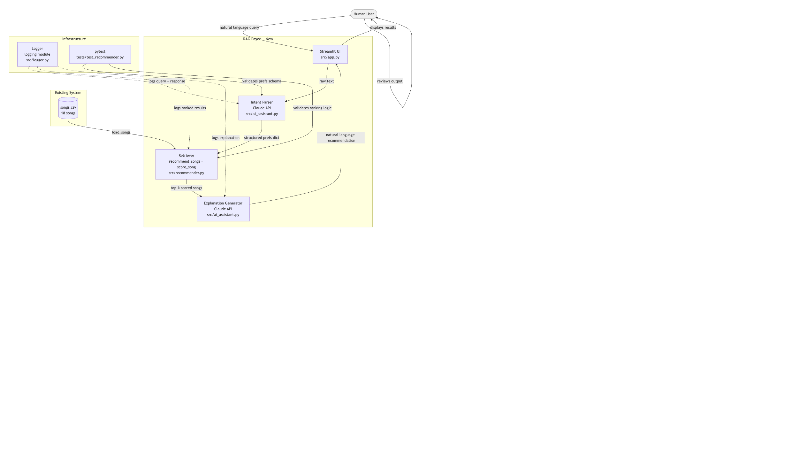

# AI Music Recommender with Natural Language Search

## Title and Summary

This project is an AI-enhanced music recommender that helps users discover songs by describing what they want in natural language, such as "something chill for a late night study session" or "something upbeat and danceable for a party." It matters because it makes music discovery feel more human: users can describe a vibe, context, or mood instead of manually filling out a structured preference form.

The application combines a rule-based recommender with an AI interpretation layer. The AI layer translates free-text requests into structured preferences, the recommender retrieves and ranks songs from the catalog, and the system then generates a short explanation for why the results fit the request. If the external model is unavailable, the app falls back to local rule-based parsing and explanation so the system still works.

## Original Project (Modules 1-3)

The original project was called **Music Recommender Simulation**. Its goal was to model how a simple recommender system works by scoring a small catalog of songs against a structured user preference profile containing fields such as genre, mood, energy, and optional audio-feature targets like tempo or danceability.

In its original version, the system could load songs from a CSV file, compute weighted similarity scores, rank results, and explain recommendations using transparent scoring logic. Its strengths were simplicity and explainability, but it required users to think in structured inputs rather than natural language.

## What the Project Does Now

This updated version turns the original recommender into a more usable AI system. Instead of asking users to manually enter a dictionary of preferences, the app accepts natural language, interprets the request, retrieves the best matching songs from the catalog, and explains the recommendations in plain language.

The system follows a lightweight Retrieval-Augmented Generation style workflow:

1. The user enters a natural-language request.
2. The AI layer parses the request into structured music preferences.
3. The recommendation engine ranks songs from `data/songs.csv`.
4. The AI layer explains why the top results match.
5. If the Gemini API is unavailable, the system falls back to a local parser and local explanation path.

## Architecture Overview

The system has four main parts:

- **Streamlit UI (`src/app.py`)**
  - Collects the user's request and displays recommendations.
- **AI + Fallback Layer (`src/ai_assistant.py`)**
  - Parses natural-language prompts into structured preference dictionaries.
  - Generates short recommendation explanations.
  - Falls back to local rule-based parsing and explanation if Gemini is unavailable.
- **Recommendation Engine (`src/recommender.py`)**
  - Loads the catalog from `data/songs.csv`.
  - Scores songs using genre, mood, energy, and optional numeric feature similarity.
  - Returns the top-ranked songs.
- **Infrastructure (`src/logger.py`, `tests/test_recommender.py`, `.env`)**
  - Logs requests and errors.
  - Loads the Gemini API key.
  - Verifies ranking logic, parser output shape, and fallback behavior.

In the system diagram, data flows from the human user to the Streamlit app, then into the AI parsing layer, then into the retriever/ranker, and finally back through the explanation layer to the user. Testing and logging support the system by checking correctness and capturing failures.

## System Diagram

### UML Snapshot



### Mermaid Source

```mermaid
flowchart TD
    User([Human User]):::human -->|natural language request| UI

    subgraph APP ["Application Layer"]
        UI["Streamlit UI\nsrc/app.py"]
    end

    subgraph AI ["AI + Fallback Layer"]
        Parser["Preference Parser\nparse_preferences()\nsrc/ai_assistant.py"]
        Explainer["Recommendation Explainer\nexplain_recommendations()\nsrc/ai_assistant.py"]
        Gemini["Gemini API\nprimary path"]
        Fallback["Local fallback parser + explainer\nrule-based backup path"]
    end

    subgraph CORE ["Recommendation Engine"]
        Retriever["Retriever / Ranker\nrecommend_songs() · score_song()\nsrc/recommender.py"]
        Catalog[(songs.csv\nmusic catalog)]
    end

    subgraph INFRA ["Infrastructure + Validation"]
        Logger["Logger\nsrc/logger.py"]
        Env[".env\nGEMINI_API_KEY"]
        Tests["pytest tests\ntests/test_recommender.py"]
    end

    UI -->|user text| Parser
    Parser -->|try API call| Gemini
    Parser -->|on API/quota failure| Fallback
    Gemini -->|structured preferences| Retriever
    Fallback -->|structured preferences| Retriever

    Catalog -->|load_songs()| Retriever
    Retriever -->|top-k ranked songs| Explainer

    Explainer -->|try API call| Gemini
    Explainer -->|on API/quota failure| Fallback
    Gemini -->|natural-language explanation| UI
    Fallback -->|natural-language explanation| UI

    Retriever -->|ranked songs + scores| UI
    UI -->|recommended songs shown| User

    Env -->|loads key| Parser
    Env -->|loads key| Explainer

    Logger -. logs requests/errors .-> Parser
    Logger -. logs ranking/results .-> Retriever
    Logger -. logs explanations .-> Explainer

    Tests -->|tests parser output| Parser
    Tests -->|tests fallback behavior| Fallback
    Tests -->|tests ranking logic| Retriever

    classDef human fill:#f0f0f0,stroke:#999
```

## Setup Instructions

### 1. Clone the repository

```bash
git clone https://github.com/anaoliveira01/music-recommender-applied-ai-system-project.git
cd music-recommender-applied-ai-system-project
```

### 2. Create a virtual environment

```bash
python3 -m venv .venv
source .venv/bin/activate
```

On Windows:

```bash
.venv\Scripts\activate
```

### 3. Install dependencies

```bash
python3 -m pip install -r requirements.txt
```

### 4. Add your API key

Create a `.env` file in the project root:

```env
GEMINI_API_KEY=your_api_key_here
```

Notes:

- The app can still run with its local fallback logic if the API is unavailable.
- The `.env` file should not be committed to GitHub.

### 5. Run the app

```bash
python3 -m streamlit run src/app.py
```

### 6. Run tests

```bash
python3 -m pytest tests/ -v
```

## Sample Interactions

These examples were generated from the working system.

### Example 1

**User input**

```text
something chill for a late night study session
```

**Parsed preferences**

```python
{"genre": "pop", "mood": "chill", "energy": 0.4}
```

**Top recommendations**

1. `Midnight Coding` by LoRoom
2. `Library Rain` by Paper Lanterns
3. `Spacewalk Thoughts` by Orbit Bloom

**AI explanation**

> I matched your request for "something chill for a late night study session" using the song catalog's genre, mood, and audio features. Midnight Coding and Library Rain rise to the top because they align most closely with a chill mood and lofi sound.

### Example 2

**User input**

```text
something upbeat and danceable for a party
```

**Parsed preferences**

```python
{"genre": "pop", "mood": "happy", "energy": 0.85, "danceability": 0.85}
```

**Top recommendations**

1. `Sunrise City` by Neon Echo
2. `Rooftop Lights` by Indigo Parade
3. `Gym Hero` by Max Pulse

**AI explanation**

> I matched your request for "something upbeat and danceable for a party" using the song catalog's genre, mood, and audio features. Sunrise City and Rooftop Lights rise to the top because they align most closely with a happy mood and pop sound.

### Example 3

**User input**

```text
something intense for a late-night drive
```

**Parsed preferences**

```python
{"genre": "pop", "mood": "intense", "energy": 0.4}
```

**Top recommendations**

1. `Gym Hero` by Max Pulse
2. `Storm Runner` by Voltline
3. `Sunrise City` by Neon Echo

**AI explanation**

> I matched your request for "something intense for a late-night drive" using the song catalog's genre, mood, and audio features. Gym Hero and Storm Runner rise to the top because they align most closely with an intense mood and pop sound.

Note: outputs may vary depending on whether the Gemini API path or the fallback path is used.

## Design Decisions

I chose to build on top of the original weighted recommender instead of replacing it with a fully model-driven approach. That preserved the strongest part of the original system: transparent scoring logic. A future employer looking at this repository can see exactly how retrieval works, how the system interprets user input, and how the ranking engine behaves.

I added AI at the input and explanation stages rather than making the model directly select songs from scratch. This design makes the system more controllable and easier to debug. The trade-off is that recommendation quality is still limited by the small catalog and the hand-designed scoring function. The AI improves usability and expressiveness, but it does not solve the dataset limitations by itself.

I also added a **local fallback path**. External APIs can fail because of quotas, billing limits, network issues, or missing credentials. Instead of letting the whole app break, the parser and explainer now fall back to rule-based logic. The trade-off is that the fallback is less nuanced than a working model API, but it makes the system much more reliable and easier to demonstrate.

## Testing Summary

I tested both the original recommendation logic and the new AI integration points.

This project includes multiple ways to prove the AI system works instead of only appearing to work:

- **Automated tests:** `pytest` checks ranking behavior, parser output shape, consistency of recommendations, explanation generation, and fallback behavior when the external AI path fails.
- **Logging and error handling:** `src/logger.py` records requests, parsing steps, explanations, and failures. This made it possible to diagnose issues such as missing API keys, quota failures, and logging portability problems.
- **Human evaluation:** I manually reviewed recommendation outputs for prompts such as "something chill for a late night study session" and "something upbeat and danceable for a party" to confirm that the returned songs matched the intended mood and context.

What worked:

- The recommender correctly sorts songs by descending score.
- The explanation path returns readable output.
- The parser returns the required keys needed by the ranker.
- The system remains functional when the model client fails, thanks to the fallback path.

What did not work smoothly at first:

- The original external-model path failed due to API quota and environment issues.
- Logging initially assumed file logging would always be available, which caused portability issues in restricted environments.
- Early versions of the app surfaced misleading errors such as "check your API key," even when the real issue was quota exhaustion.

What I learned:

- Reliability is not just about correctness when everything goes right; it is also about graceful behavior when dependencies fail.
- External AI systems introduce operational complexity that does not exist in a purely local program.
- Good logging, validation, and fallback behavior are just as important as the AI feature itself.

Current automated test coverage includes:

- ranking order validation
- explanation non-emptiness
- recommender output schema checks
- consistency checks
- parser output validation
- fallback parser behavior

**Testing summary:** 6 out of 6 automated tests passed. The biggest issues during development were not ranking bugs, but operational failures involving API quota limits, environment configuration, and logging assumptions. Reliability improved after adding explicit `.env` loading, clearer error handling, and a local fallback parser/explainer so the app still works when the external AI service is unavailable.

## Reflection

This project taught me that AI features are most useful when they solve a real interface problem. The original recommender already had a working ranking engine, but it expected users to think like programmers by entering structured preferences. Adding natural-language interpretation made the system feel much closer to how a real person would search for music.

It also taught me that building AI systems is as much about failure handling as it is about model capability. A model API can be impressive when it works, but a production-minded system still needs logging, validation, and a backup plan when it does not. The final design reflects that lesson: a smaller but dependable system is often better engineering than a more impressive system that breaks easily.

More broadly, this project reinforced that good problem-solving comes from layering tools thoughtfully. The best result here was not "replace everything with AI," but rather "use AI where it improves the human experience, and keep the underlying retrieval logic understandable and testable."

### Limitations and Biases

The biggest limitation in this system is the dataset itself. The catalog only contains 18 songs, and genre coverage is uneven, so some genres have much less variety than others. That means the recommender can over-repeat certain songs, under-serve niche tastes, and reflect the biases of the catalog rather than the full range of what a real listener might want. The fallback parser also uses simple keyword heuristics, which means nuanced prompts can still be interpreted imperfectly.

### Potential Misuse and Safeguards

This project could be misused if someone treated it like a fully personalized production recommender when it is really a classroom-scale prototype. For example, a user might assume the system deeply understands their taste, when in reality it is ranking against a small static dataset with limited context. To reduce that risk, I would keep the scope explicit in the README and UI, log failures clearly, validate parsed outputs before ranking, and preserve transparent recommendation reasons so users can see why songs were chosen.

### What Surprised Me During Reliability Testing

What surprised me most was that the hardest problems were not the ranking formula itself, but the operational issues around AI integration. The recommender logic was relatively stable, while the bigger failures came from API quotas, missing environment configuration, and assumptions about logging. That changed how I think about reliability: a system is not reliable just because the algorithm is correct; it also has to behave well when external dependencies fail.

### Collaboration with AI

Working with AI on this project was useful, but it also showed the importance of checking suggestions carefully. One genuinely helpful suggestion was using AI to translate natural-language requests into the structured preference format that the original recommender already understood. That let me improve usability without throwing away the existing ranking engine.

One flawed suggestion was the repeated assumption that model or quota errors could be fixed simply by swapping providers or changing model names. That advice was too speculative and did not fully respect the need to verify what the actual problem was before making changes. The lesson for me was that AI can be a strong brainstorming and implementation partner, but it still needs human judgment, debugging discipline, and verification at every step.

## Repository Structure

```text
music-recommender-applied-ai-system-project/
├── data/
│   └── songs.csv
├── imgs/
│   ├── 2026-04-14(1).png
│   ├── 2026-04-14(2).png
│   ├── 2026-04-14(3).png
│   └── mermaid-diagram-2026-04-28-155916.png
├── src/
│   ├── ai_assistant.py
│   ├── app.py
│   ├── logger.py
│   ├── main.py
│   └── recommender.py
├── tests/
│   └── test_recommender.py
├── model_card.md
├── requirements.txt
└── README.md
```

## Future Improvements

- Expand the song catalog so retrieval has more variety and better genre coverage.
- Support negative preferences such as "not too fast" or "no metal."
- Improve the local fallback parser so it can capture more nuanced moods and contexts.
- Add user feedback loops so the system can avoid repeating the same recommendations.
- Introduce embedding-based retrieval for richer semantic matching on a larger dataset.
